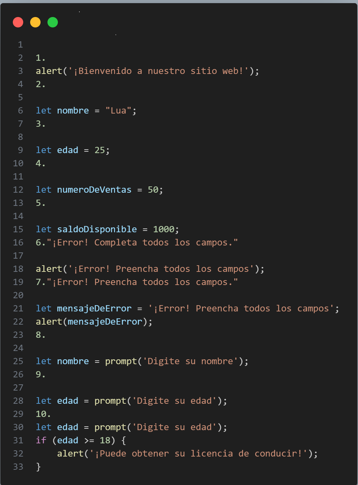

Resolución de los desafíos del curso de lógica de programación
Practicar la lógica de programación, incluyendo conceptos como variables, condicionales (if-else), bucles (while) e interacciones con el usuario (alert, prompt), es esencial para tu carrera en desarrollo de software. Estos fundamentos proporcionan la base para resolver problemas de manera estructurada, tomar decisiones en el código, crear bucles controlados e interactuar eficazmente con los usuarios.

